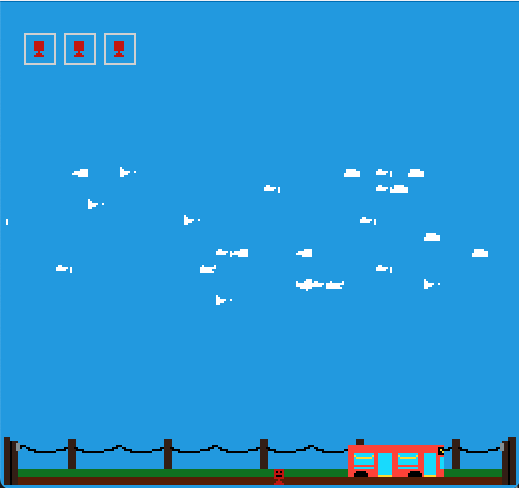

# Unrealistic PRT Bus Simulator

Author: Emily Amspoker

Design: This game is based on picking people up on a bus, but you can only come to a rolling stop. I think this is different from a lot of racing games because you need to slow down sometimes (passengers can't get on if you go to slow) and probably different from a realistic bus simulator because you can only slow down and speed up.

Screen Shot:

How Your Asset Pipeline Works:
For each set of tiles in the game, one must create two pngs. One of the PNGs is the actual tileset, whose size must be some multiple of an 8x8 pixel square. The other PNG is a 2x2 pixel palette. The tileset must only use colors that are included in the palette. 

The AssetMaekfile runs the [create tiles](create_tiles.cpp) file, which uses helper functions written in the [load save png](load_save_png.cpp) file that create a .tile binary file from each pair of the tileset and palette png. This binary includes: the number of tiles in the tileset, a chunk of data describing each tile as a vector of indices into the palette vector, and the palette vector (which is a vector of rgba values).

During runtime, the [PlayMode](PlayMode.cpp) file calls helper functions from [load save png](load_save_png.cpp) to read the .tile files. It then loads them in to a TileInfo struct, which includes a vector of PPU466::Tile objects and a PPU466::Palette for every tileset. The tiles are then loaded into the PPU's tiletable and the palettes are loaded into the PPU's palette table.

The PNGs as well as the .tile files can be found at: [dist/assets](dist/assets).

How To Play:

Press the up arrow to go faster and press the down arrow to go slower (if you don't press anything, the bus keeps rolling at a constant speed). You must pick up three people before the day ends. You can only pick up people if you give them enough time to hop on, so roll slowly when you see a potential passenger!

This game was built with [NEST](NEST.md).

